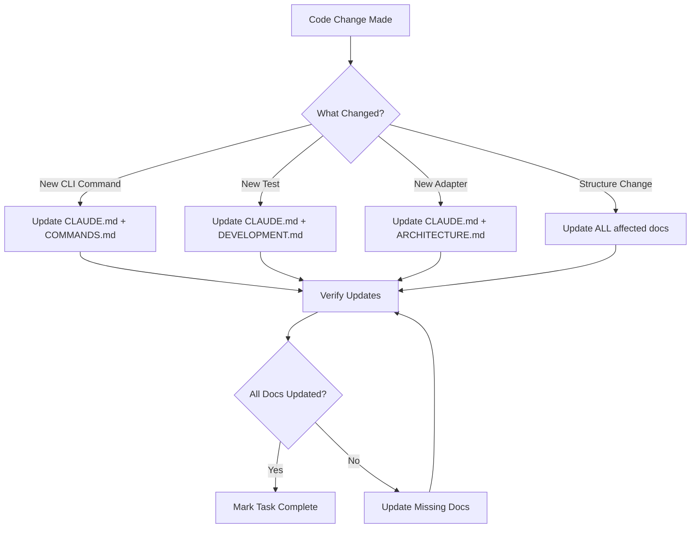

# Documentation Maintenance Rule

**CRITICAL**: This rule defines which documentation files MUST be updated when making changes to the codebase.

---

## 🚨 MANDATORY: Always Update Documentation

When you make ANY of the changes listed below, you MUST update the corresponding documentation files. This is not optional.

---

## Documentation Update Matrix

### 1. Adding a New CLI Command

**Files to Update:**

| File | What to Update | Priority |
|------|---------------|----------|
| **`CLAUDE.md`** | Add to "By Feature / Command" table | 🔴 CRITICAL |
| **`docs/COMMANDS.md`** | Add command examples and usage | 🔴 CRITICAL |
| **`docs/DEVELOPMENT.md`** | Update if adds new pattern | 🟡 IF NEEDED |
| **`README.md`** | Add to feature list (if major feature) | 🟡 IF NEEDED |
| **`cmd/nylas/main.go`** | Register command (code, not doc) | 🔴 CRITICAL |

**Example Trigger:**
- Created `internal/cli/widgets/`
- Added `NewWidgetCmd()` function

**Action:**
1. Update CLAUDE.md feature table:
   ```markdown
   | **Widgets** | `internal/cli/widgets/` | `internal/adapters/nylas/widgets.go` | `internal/domain/widget.go` | `internal/cli/integration/widgets_test.go` |
   ```

2. Add to docs/COMMANDS.md:
   ```markdown
   ## Widget Commands

   ### List Widgets
   \`\`\`bash
   nylas widgets list
   \`\`\`
   ```

---

### 2. Adding Integration Tests

**Files to Update:**

| File | What to Update | Priority |
|------|---------------|----------|
| **`CLAUDE.md`** | Update feature table test column | 🔴 CRITICAL |
| **`docs/DEVELOPMENT.md`** | Add to integration test list | 🔴 CRITICAL |
| **`internal/cli/integration/README.md`** | Add test file description | 🟡 IF NEEDED |

**Example Trigger:**
- Created `internal/cli/integration/widgets_test.go`

**Action:**
1. Update CLAUDE.md feature table (Tests column)
2. Update docs/DEVELOPMENT.md integration test table
3. Add to internal/cli/integration/README.md file list

---

### 3. Adding New Adapter/API Method

**Files to Update:**

| File | What to Update | Priority |
|------|---------------|----------|
| **`CLAUDE.md`** | Update feature table adapter column | 🔴 CRITICAL |
| **`docs/ARCHITECTURE.md`** | Update if changes architecture | 🟡 IF NEEDED |
| **`CODE_INDEX.md`** | Add method to adapter list | 🟡 IF NEEDED |

**Example Trigger:**
- Added `GetWidgets()` to `internal/adapters/nylas/widgets.go`
- Added method to `internal/ports/nylas.go`

**Action:**
1. Update CLAUDE.md if it's a new file
2. Update CODE_INDEX.md with new method

---

### 4. Adding New Domain Model

**Files to Update:**

| File | What to Update | Priority |
|------|---------------|----------|
| **`CLAUDE.md`** | Update feature table domain column | 🔴 CRITICAL |
| **`docs/ARCHITECTURE.md`** | Add to domain model section | 🟡 IF NEEDED |

**Example Trigger:**
- Created `internal/domain/widget.go`

**Action:**
1. Update CLAUDE.md feature table (Domain Model column)
2. Add to ARCHITECTURE.md if it's a significant model

---

### 5. Changing Test Structure/Location

**Files to Update:**

| File | What to Update | Priority |
|------|---------------|----------|
| **`CLAUDE.md`** | Update test file paths | 🔴 CRITICAL |
| **`docs/DEVELOPMENT.md`** | Update test commands and paths | 🔴 CRITICAL |
| **`.claude/workflows/run-integration-tests.md`** | Update test commands | 🔴 CRITICAL |
| **`.claude/rules/test-naming.md`** | Update test conventions | 🔴 CRITICAL |
| **`.claude/commands/add-integration-test.md`** | Update test location | 🔴 CRITICAL |
| **`.claude/commands/run-tests.md`** | Update test commands | 🔴 CRITICAL |
| **`.claude/rules.md`** | Update test paths | 🔴 CRITICAL |

**Example Trigger:**
- Moved tests from `internal/cli/` to `internal/cli/integration/`
- Changed test naming from `integration_*_test.go` to `*_test.go`

**Action:**
Update ALL listed files with new paths and conventions.

---

### 6. Adding New Claude Skill/Workflow

**Files to Update:**

| File | What to Update | Priority |
|------|---------------|----------|
| **`CLAUDE.md`** | Add to "Useful Commands" table | 🟡 IF NEEDED |
| **`docs/DEVELOPMENT.md`** | Add to workflow section | 🟡 IF NEEDED |

**Example Trigger:**
- Created `.claude/commands/new-skill.md`
- Created `.claude/workflows/new-workflow.md`

**Action:**
1. Document the skill in CLAUDE.md if it's user-facing
2. Add example usage

---

### 7. Security Changes

**Files to Update:**

| File | What to Update | Priority |
|------|---------------|----------|
| **`docs/SECURITY.md`** | Document security measures | 🔴 CRITICAL |
| **`CLAUDE.md`** | Update security guidelines | 🟡 IF NEEDED |

**Example Trigger:**
- Added credential encryption
- Changed authentication method
- Added security scan

**Action:**
Update SECURITY.md with new security measures.

---

### 8. Architecture Changes

**Files to Update:**

| File | What to Update | Priority |
|------|---------------|----------|
| **`docs/ARCHITECTURE.md`** | Update architecture diagrams/description | 🔴 CRITICAL |
| **`CLAUDE.md`** | Update architecture overview | 🟡 IF NEEDED |
| **`README.md`** | Update if major change | 🟡 IF NEEDED |

**Example Trigger:**
- Changed from hexagonal to onion architecture
- Added new layer (e.g., service layer)
- Changed directory structure

**Action:**
Update architecture documentation to reflect changes.

---

### 9. Utility Features (Timezone, Webhook, etc.)

**Files to Update:**

| File | What to Update | Priority |
|------|---------------|----------|
| **`plan.md`** | Mark feature as complete | 🔴 CRITICAL |
| **`local/suggestions.md`** | Update feature status | 🔴 CRITICAL |
| **`CLAUDE.md`** | Add to feature table | 🔴 CRITICAL |
| **`docs/COMMANDS.md`** | Add command examples | 🔴 CRITICAL |

**Example Trigger:**
- Completed timezone CLI implementation
- Added webhook testing server

**Action:**
1. Mark feature complete in plan.md
2. Update status in suggestions.md
3. Add to CLAUDE.md and COMMANDS.md

---

### 10. Timezone-Related Changes ⚠️ CRITICAL

**Files to Update:**

| File | What to Update | Priority |
|------|---------------|----------|
| **`docs/TIMEZONE.md`** | Update timezone usage guide | 🔴 CRITICAL |
| **`docs/COMMANDS.md`** | Update calendar/timezone command examples | 🔴 CRITICAL |
| **`CLAUDE.md`** | Update timezone feature references | 🔴 CRITICAL |
| **`AI_plan.md`** | Update implementation status | 🟡 IF NEEDED |

**Example Triggers:**

**ANY of these changes require updating `docs/TIMEZONE.md`:**
- ✅ Modified `internal/cli/calendar/helpers.go` (timezone conversion logic)
- ✅ Modified `internal/cli/calendar/events.go` (timezone flags: `--timezone`, `--show-tz`)
- ✅ Modified `internal/adapters/utilities/timezone/service.go` (timezone service methods)
- ✅ Added/modified DST detection or warnings
- ✅ Added/modified natural language time parsing
- ✅ Changed timezone auto-detection logic
- ✅ Added/modified timezone validation
- ✅ Changed IANA timezone ID handling
- ✅ Modified working hours validation with timezones
- ✅ Changed timezone display formatting
- ✅ Added new timezone-related flags or commands
- ✅ Modified timezone locking for events
- ✅ Changed multi-timezone event display logic

**Action:**
1. **ALWAYS update `docs/TIMEZONE.md`** with:
   - New timezone features or flags
   - Changed behavior or output format
   - New examples showing the change
   - Updated best practices if applicable
   - Troubleshooting for common issues

2. Update `docs/COMMANDS.md` if command usage changed

3. Update `CLAUDE.md` feature table if new files created

4. Update `AI_plan.md` if completing a planned task

**Example:**
```markdown
# Trigger: Added --timezone flag to calendar events list

# Action 1: Update docs/TIMEZONE.md
## Viewing Events in Different Timezones

You can view all calendar events converted to any timezone:

\`\`\`bash
nylas calendar events list --timezone America/Los_Angeles
\`\`\`

This displays:
- Event times converted to the specified timezone
- Original timezone in parentheses
- Timezone abbreviations (PST, EST, etc.)

# Action 2: Update docs/COMMANDS.md
### Calendar Events

\`\`\`bash
# List events with timezone conversion
nylas calendar events list --timezone America/Los_Angeles
\`\`\`

# Action 3: Update CLAUDE.md (if new file created)
| **Calendar** | `internal/cli/calendar/` | ... | `internal/cli/calendar/helpers.go` ⚡ |
```

**Why This Is Critical:**

Timezone handling is complex and error-prone. Users need:
- Clear examples of how to use timezone features
- Understanding of IANA timezone IDs vs abbreviations
- DST transition warnings and how to handle them
- Best practices for multi-timezone scheduling
- Troubleshooting for common timezone issues

**`docs/TIMEZONE.md` must be the single source of truth for all timezone-related usage.**

---

### 11. Working Hours & Break Management Changes ⚠️ CRITICAL

**Files to Update:**

| File | What to Update | Priority |
|------|---------------|----------|
| **`docs/TIMEZONE.md`** | Update Working Hours & Break Management section | 🔴 CRITICAL |
| **`docs/COMMANDS.md`** | Update Break Time Protection examples | 🔴 CRITICAL |
| **`docs/ARCHITECTURE.md`** | Update domain model documentation | 🔴 CRITICAL |
| **`CLAUDE.md`** | Update Calendar feature table | 🔴 CRITICAL |
| **`docs/DEVELOPMENT.md`** | Update test patterns for break validation | 🟡 IF NEEDED |
| **`docs/AI.md`** | Update AI break awareness | 🟡 IF NEEDED |

**Example Triggers:**

**ANY of these changes require updating documentation:**
- ✅ Modified `internal/domain/config.go` (WorkingHoursConfig, DaySchedule, BreakBlock)
- ✅ Modified `internal/cli/calendar/helpers.go` (break validation logic)
- ✅ Modified `internal/cli/calendar/events.go` (break enforcement in event creation)
- ✅ Added/modified break validation functions
- ✅ Changed break block data structure
- ✅ Added new break types (lunch, coffee, custom)
- ✅ Modified working hours validation with breaks
- ✅ Changed break enforcement behavior (hard block vs soft warning)
- ✅ Added break-related configuration options
- ✅ Modified break scheduling constraints

**Action:**
1. **ALWAYS update `docs/TIMEZONE.md`** with:
   - New break configuration options
   - Break block examples and use cases
   - Difference between hard blocks (breaks) vs soft warnings (working hours)
   - Tips for break management
   - Troubleshooting for break conflicts

2. Update `docs/COMMANDS.md` with break examples showing:
   - Configuration YAML for breaks
   - Break conflict error messages
   - How to schedule around breaks

3. Update `docs/ARCHITECTURE.md` with:
   - BreakBlock domain model documentation
   - Working hours architecture explanation
   - Validation logic overview

4. Update `CLAUDE.md` feature table to reference `config.go` for breaks

5. Update `docs/DEVELOPMENT.md` with break validation test patterns (if applicable)

6. Update `docs/AI.md` with how AI respects break blocks (if applicable)

**Example:**
```markdown
# Trigger: Added BreakBlock struct to internal/domain/config.go

# Action 1: Update docs/TIMEZONE.md
### Working Hours & Break Management

Configure your working hours and break periods:

\`\`\`yaml
working_hours:
  default:
    enabled: true
    start: "09:00"
    end: "17:00"
    breaks:
      - name: "Lunch"
        start: "12:00"
        end: "13:00"
        type: "lunch"
\`\`\`

**Hard Block Enforcement:**
Events cannot be scheduled during break times.

# Action 2: Update docs/COMMANDS.md
**Break Time Protection:**

\`\`\`bash
$ nylas calendar events create --title "Meeting" --start "12:30"

⛔ Break Time Conflict
Event cannot be scheduled during Lunch (12:00 - 13:00)
\`\`\`

# Action 3: Update docs/ARCHITECTURE.md
### Working Hours and Break Management

Domain models:
- **BreakBlock** - Break periods (lunch, coffee) with hard scheduling constraints
- **DaySchedule** - Working hours with optional break periods
- **WorkingHoursConfig** - Per-day configuration

# Action 4: Update CLAUDE.md
| **Calendar** (with timezone & breaks ⚡) | ... | `internal/domain/config.go` 📅 Working Hours & Breaks | ...
```

**Why This Is Critical:**

Working hours and break management are essential for:
- Protecting user's lunch time and breaks
- Preventing scheduling conflicts
- Supporting work-life balance
- Enabling AI to respect break preferences

**Key Documentation Requirements:**
- Configuration examples with YAML syntax
- Clear explanation of hard blocks vs soft warnings
- Multiple break types (lunch, coffee, custom)
- Day-specific break configurations
- Break validation test patterns
- AI integration with break awareness

---

## Quick Reference Checklist

Before marking ANY task as complete, verify:

### For New Features:
- [ ] Updated CLAUDE.md feature table
- [ ] Updated docs/COMMANDS.md with examples
- [ ] Updated plan.md (if utility feature)
- [ ] Updated README.md (if major feature)

### For New Tests:
- [ ] Updated CLAUDE.md test paths
- [ ] Updated docs/DEVELOPMENT.md test list
- [ ] Updated integration/README.md (if integration test)

### For Structural Changes:
- [ ] Updated ALL affected documentation files
- [ ] Verified no old references remain
- [ ] Updated .claude/ rules and workflows

### For Security Changes:
- [ ] Updated docs/SECURITY.md
- [ ] Updated security guidelines in CLAUDE.md

### For Timezone Changes:
- [ ] Updated docs/TIMEZONE.md with new features/behavior
- [ ] Updated docs/COMMANDS.md with timezone command examples
- [ ] Updated CLAUDE.md timezone feature references
- [ ] Verified all timezone examples still work
- [ ] Added troubleshooting for common issues (if applicable)

### For Working Hours & Break Changes:
- [ ] Updated docs/TIMEZONE.md Working Hours & Break Management section
- [ ] Updated docs/COMMANDS.md with Break Time Protection examples
- [ ] Updated docs/ARCHITECTURE.md with BreakBlock domain model
- [ ] Updated CLAUDE.md Calendar feature table to mention breaks
- [ ] Updated docs/DEVELOPMENT.md with break validation tests (if applicable)
- [ ] Updated docs/AI.md with break awareness (if applicable)
- [ ] Verified break configuration examples work
- [ ] Added troubleshooting for break conflicts

---

## Files That Should NEVER Reference Local Structure

**Exclude from Updates:**
- ❌ `local/*.md` - Project-specific, temporary documentation
- ❌ `local/suggestions.md` - Feature proposals (only update status)
- ❌ `local/SECURITY_REPORT.md` - Historical security report
- ❌ `local/well-architected-optimizations.md` - Architecture notes

**Only update `plan.md` and `local/suggestions.md` for utility feature status.**

---

## Documentation Update Workflow



---

## Automation: Documentation Update Command

When making changes, use this checklist:

```bash
# After making code changes, search for files that might need updates:

# 1. Check for references to old paths/names
grep -r "old-pattern" docs/ .claude/ *.md

# 2. Verify documentation is consistent
grep -r "your-feature" docs/ .claude/ *.md

# 3. Update all found references
# (Use Edit tool to update each file)
```

---

## Example: Complete Documentation Update

**Scenario:** Added new "scheduler" CLI commands

### Step 1: Code Changes
- Created `internal/cli/scheduler/`
- Created `internal/adapters/nylas/scheduler.go`
- Created `internal/domain/scheduler.go`
- Created `internal/cli/integration/scheduler_test.go`

### Step 2: Documentation Updates

**CLAUDE.md:**
```markdown
| **Scheduler** | `internal/cli/scheduler/` | `internal/adapters/nylas/scheduler.go` | `internal/domain/scheduler.go` | `internal/cli/integration/scheduler_test.go` |
```

**docs/COMMANDS.md:**
```markdown
## Scheduler Commands

### List Configurations
\`\`\`bash
nylas scheduler list
\`\`\`

### Get Configuration
\`\`\`bash
nylas scheduler show <config-id>
\`\`\`
```

**docs/DEVELOPMENT.md:**
```markdown
| `scheduler_test.go` | Scheduler command tests |
```

### Step 3: Verification
- [x] CLAUDE.md updated
- [x] docs/COMMANDS.md updated
- [x] docs/DEVELOPMENT.md updated
- [x] No old references remain

---

## Priority Levels Explained

🔴 **CRITICAL** - MUST update immediately (core documentation)
🟡 **IF NEEDED** - Update if the change is significant or user-facing
🟢 **OPTIONAL** - Update for completeness, but not required

---

## Enforcement

**This rule is MANDATORY and must be followed for:**
- ✅ All new features
- ✅ All structural changes
- ✅ All test organization changes
- ✅ All security updates
- ✅ All architecture changes

**If you complete a task without updating documentation:**
- ❌ The task is NOT complete
- ❌ Do not mark todo as completed
- ❌ Go back and update all required documentation

---

## Summary

**Golden Rule:** If you changed the code, update the docs.

**Files that are ALWAYS updated for new features:**
1. `CLAUDE.md` (feature table)
2. `docs/COMMANDS.md` (examples)
3. `docs/DEVELOPMENT.md` (if test-related)
4. `docs/TIMEZONE.md` (if timezone-related) ⚠️ CRITICAL

**Files that are NEVER updated (exclude):**
- `local/*.md` (except `plan.md` status for utilities)

**Verification:**
```bash
# Always verify no old references remain after structural changes
grep -r "old-pattern" docs/ .claude/ *.md
```

---

**Last Updated:** December 21, 2025
**Maintained By:** Development Team
