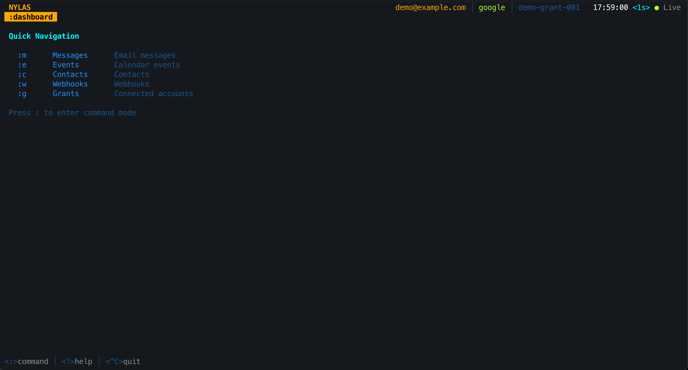
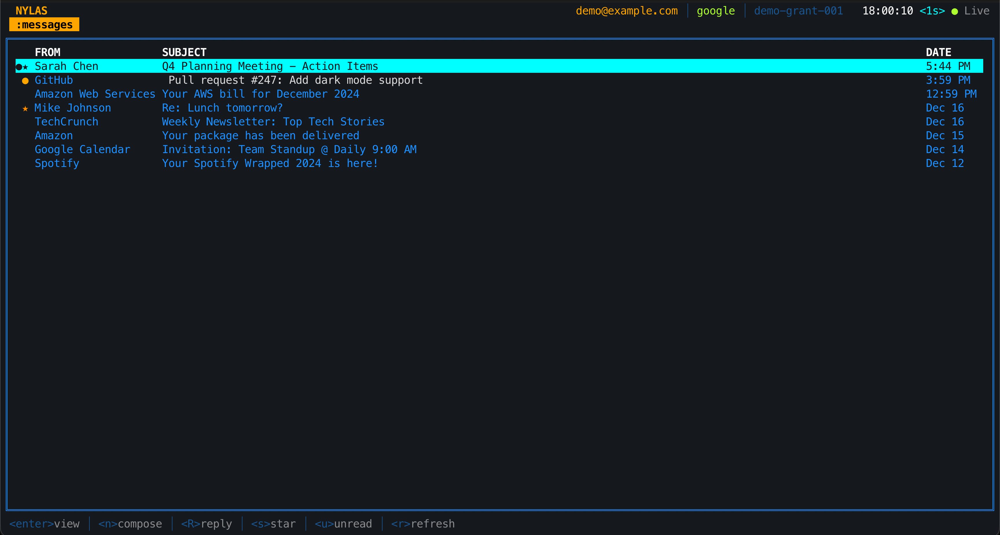
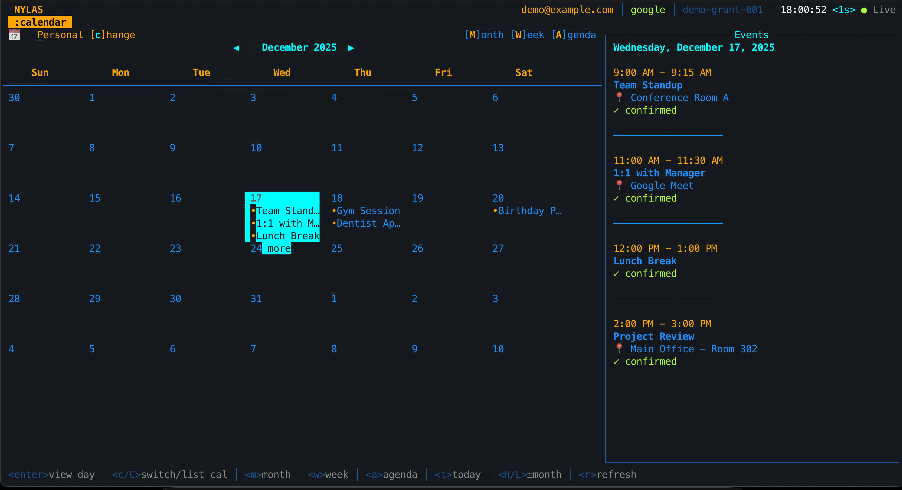
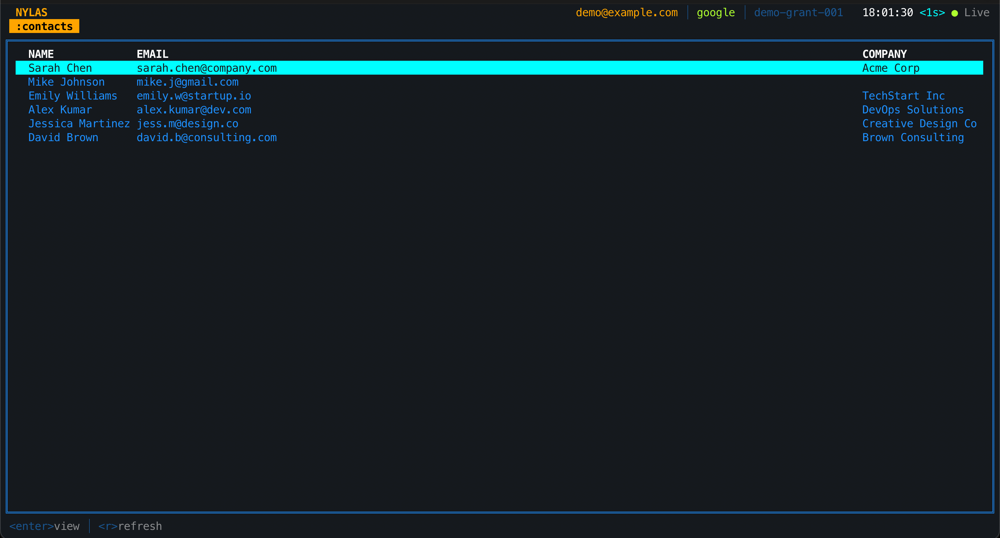
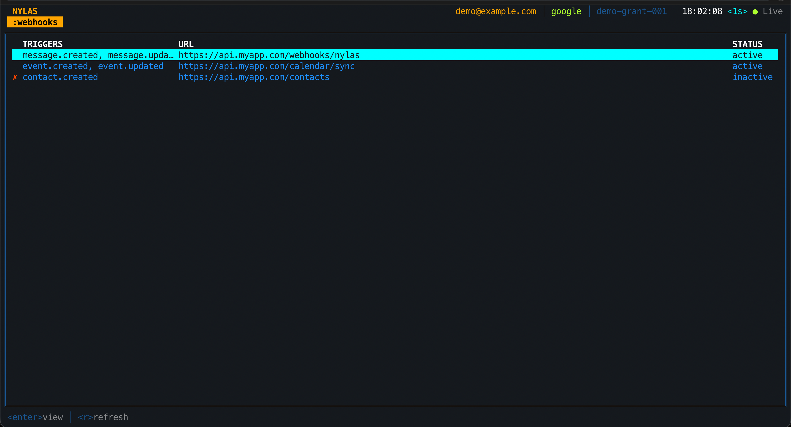

# Terminal UI (TUI)

Interactive terminal interface for Nylas email, calendar, and contacts.

> **Quick Links:** [README](../../README.md) | [Commands](../COMMANDS.md) | [Development](../DEVELOPMENT.md)

---

## Launch

```bash
nylas tui                    # Start at dashboard
nylas tui messages           # Start at messages view
nylas tui events             # Start at calendar view
nylas tui contacts           # Start at contacts view

# Demo mode (no credentials needed)
nylas tui --demo

# With theme
nylas tui --theme amber      # Retro amber CRT
nylas tui --theme green      # Green phosphor
nylas tui --theme matrix     # Matrix green
```

---

## Navigation

| Key | Action |
|-----|--------|
| `↑/↓` or `j/k` | Move up/down |
| `Enter` | Select/open |
| `Esc` | Go back |
| `Tab` | Switch panels |
| `?` | Help |
| `r` | Refresh |
| `:q` | Quit |

---

## Views

```bash
:m or :messages              # Messages view
:e or :events                # Calendar view
:c or :contacts              # Contacts view
:w or :webhooks              # Webhooks view
:d or :dashboard             # Dashboard
```

---

## Quick Actions

**Messages:**
- `n` - Compose email
- `R` - Reply
- `A` - Reply all
- `s` - Toggle star
- `dd` - Delete

**Calendar:**
- `m` - Month view
- `w` - Week view
- `a` - Agenda view
- `t` - Today

---

## Screenshots

### Dashboard


### Messages View


### Calendar View


### Contacts View


### Webhooks View

